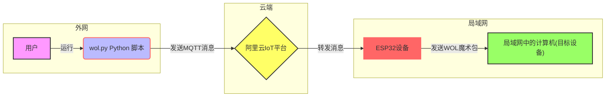

# 远程唤醒计算机：结合阿里云IoT和ESP32的实践指南

在这个技术快速发展的时代，远程控制已成为日常生活中不可或缺的一部分。本文介绍了一个实用的项目——利用阿里云IoT服务和ESP32开发板实现远程唤醒计算机。这个项目涵盖了从云端发送命令（通过Python脚本），到物联网设备接收命令并执行动作（使用ESP32）的完整流程。

## 项目概述

本项目的目标是实现一个能够远程唤醒局域网中计算机的系统。系统由三个主要部分组成：

1. **云端**：[阿里云IoT平台](https://iot.console.aliyun.com/)，用于接收来自用户的唤醒指令。
2. **控制端**：[Python脚本（`wol.py`）](https://github.com/eternal-echo/wol-py)，运行于用户的设备上（如个人电脑），向云端发送唤醒指令。
3. **设备端**：基于[ESP32的设备](https://github.com/eternal-echo/wol-esp32)，连接到局域网并订阅云端消息，接收到唤醒指令后发送WOL魔术包。

## 系统架构

ESP8266/WiFi模块：

- 负责与阿里云IoT平台建立MQTT连接。
- 接收来自IoT平台的控制消息。
- 发送WOL魔术包以唤醒指定的电脑。

阿里云IoT平台：

- 提供设备管理和消息传递功能。
- 允许用户通过云端发送控制消息到ESP8266设备。
- 维护设备状态和提供用户界面。

电脑（WOL目标设备）：

- 配置为允许通过网络接口进行唤醒（WOL功能）。
- 在局域网内，其MAC地址用于WOL魔术包的目的。

## 工作流程
初始化和连接：

- ESP8266启动并连接到WiFi网络。
- 建立与阿里云IoT平台的MQTT连接。

消息监听和处理：

- ESP8266订阅特定的MQTT主题，用于监听来自阿里云IoT平台的控制消息。
- 当接收到控制消息时，解析JSON格式的消息内容，识别需要唤醒的电脑。

WOL执行：

- 根据消息内容，ESP8266使用WOL库发送魔术包到指定的MAC地址，以唤醒对应的电脑。

### 云端 - 阿里云IoT平台

在阿里云IoT平台上，我们创建了一个产品和设备，用于接收Python脚本发送的消息，并将这些消息转发到ESP32设备。

### 控制端 - Python脚本 (`wol.py`)

该[Python脚本](https://github.com/eternal-echo/wol-py)是用户与云端交互的界面。用户通过命令行运行脚本并传递参数来指定要唤醒的计算机。脚本负责将这些指令转化为MQTT消息并发送到阿里云IoT平台。

### 设备端 - ESP32开发板

ESP32设备订阅了阿里云IoT平台的特定主题，以监听来自云端的唤醒指令。接收到消息后，它会解析消息内容并向局域网内的特定MAC地址发送WOL魔术包。

## 实现步骤

### 步骤1：设置阿里云IoT平台

1. **创建产品和设备**：在阿里云IoT平台上创建一个新产品，并为其添加一个设备。
2. **获取并记录设备凭证**：记录下设备的`ProductKey`、`DeviceName`和`DeviceSecret`，这些将在设备端和控制端脚本中使用。

### 步骤2：编写控制端Python脚本 (`wol.py`)

1. **安装依赖**：安装`alibabacloud_iot20180120`和`dotenv`库。
2. **配置环境变量**：在`.env`文件中设置`ALIBABA_CLOUD_ACCESS_KEY_ID`和`ALIBABA_CLOUD_ACCESS_KEY_SECRET`。
3. **实现命令行交互**：编写脚本以接受命令行参数，并将其转化为MQTT消息。

### 步骤3：配置和编程ESP32设备

1. **安装所需库**：确保Arduino IDE中已安装`WiFi`、`WiFiUdp`、`WakeOnLan`、`PubSubClient`和`ArduinoJson`库。
2. **配置ESP32**：根据您的网络环境和阿里云IoT平台的设备凭证，编辑`config.h`文件。
3. **编写ESP32代码**：实现功能以连接WiFi、连接MQTT服务器、订阅特定主题，并解析接收到的消息以执行WOL操作。
4. **上传代码**：将代码上传到ESP32开发板。

### 步骤4：测试和部署

1. **运行Python脚本**：在终端运行Python脚本并传递要唤醒的计算机编号，比如`python wol.py 1`。
2. **监控ESP32输出**：观察ESP32的串口输出，确认其是否成功接收到消息并发送了WOL魔术包。
3. **检查计算机响应**：确保目标计算机已正确配置WOL，并检查其是否在接收到魔术包后成功开机。

## 注意事项

- 确保阿里云IoT平台上的产品和设备已正确配置。
- 在`.env`文件中正确设置阿里云的AccessKey ID和Secret。
- ESP32应连接到能够访问目标计算机的同一局域网。
- 目标计算机的BIOS/UEFI设置中应启用WOL功能。
- 在部署ESP32代码前，务必检查所有配置信息。

## 结论

通过这个项目，我们展示了如何结合阿里云IoT服务和ESP32硬件来实现远程唤醒计算机的功能。这个系统不仅实用，而且提供了一个很好的学习物联网通信和ESP32编程的机会。无论是个人还是小型办公环境，这都是一个值得尝试的项目。

# WOL-ESP32: 远程唤醒工具

WOL-ESP32是一个基于ESP32的Arduino项目，用于远程唤醒局域网中的计算机。通过MQTT协议与阿里云IoT平台通信，接收唤醒指令并通过网络发送WOL（Wake-on-LAN）魔术包。

## 功能描述

- 使用WiFi连接到局域网。
- MQTT客户端连接阿里云IoT平台。
- 接收MQTT消息并解析为WOL指令。
- 发送WOL魔术包到局域网中的特定电脑。
- 支持OTA更新，可以远程更新ESP32的固件。

## 准备工作

在开始之前，确保你有：

- ESP32开发板。
- Arduino IDE 安装并配置ESP32开发环境。
- 网络环境，可连接到互联网和局域网。

## 安装

1. 克隆或下载本项目代码到本地。
2. 打开`wol-esp32.ino`文件。
3. 根据需要修改`config.h`文件中的配置，如WiFi设置和MQTT服务器信息。

## 运行

1. 连接ESP32开发板到电脑。
2. 在Arduino IDE中选择正确的开发板和端口。
3. 上传代码到ESP32开发板。
4. 打开串口监视器查看日志输出。

## 配置

编辑`config.h`文件来配置以下参数：

- WiFi网络名和密码。
- MQTT服务器地址、端口和凭证。
- 需要唤醒的电脑的MAC地址。

## 依赖库

此项目依赖以下Arduino库：

- `WiFi.h` - 用于WiFi连接。
- `WiFiUdp.h` - 用于UDP通信。
- `WakeOnLan.h` - 实现WOL功能。
- `PubSubClient.h` - MQTT通信。
- `ArduinoJson.h` - 解析JSON格式的MQTT消息。
- `ArduinoOTA.h` - 实现OTA功能。

## OTA更新

该项目支持OTA更新，允许通过网络上传新固件到ESP32。在代码中已包含OTA更新的相关设置和回调函数。

## 注意事项

- 确保在上传代码前正确配置所有必要的参数。
- 避免在源代码中硬编码敏感信息，如WiFi密码和MQTT凭证。
- 使用OTA功能时，请确保网络稳定，以防在固件更新过程中出现中断，可能导致设备变砖。

## 贡献与支持

欢迎对本项目进行贡献！如果您有改进意见或功能请求，请提交Issue或Pull Request。

如遇到问题，请检查以下事项：

- 确保ESP32开发板正确连接。
- 检查所有配置参数是否正确。
- 查看串口监视器的输出，以获取错误信息或调试信息。
